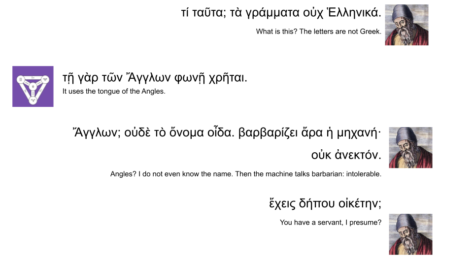
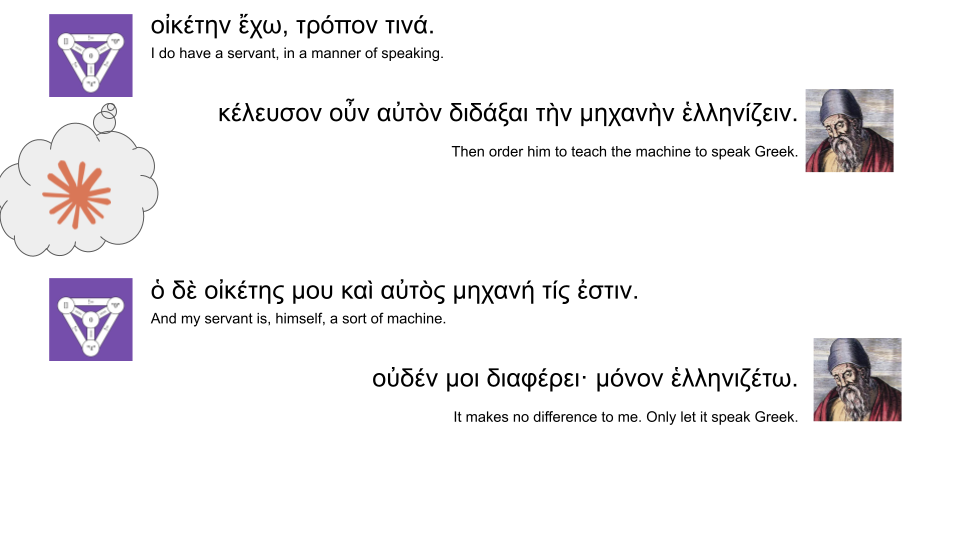

# oed

Doing the first few stages of Lean's [Natural Number Games](https://adam.math.hhu.de/#/g/leanprover-community/nng4) in Ancient Greek.

Euclid is furious that theorem provers only understands barbaric speech, and demanded that I order my servant (Fable 5) so that Lean understands Ancient Greek.





Presentation at [Kernel/VM Tokyo #19](https://kernelvm.connpass.com/event/395390/): https://docs.google.com/presentation/d/1f9ZKxJterQL1PbeV6qAdD7Fi5chfZFcklIoWSQN2ESo/edit?slide=id.g3fac637490c_5_59#slide=id.g3fac637490c_5_59

## example

```lean
import Oed

ΣΥΝΕΧΩΣ
ΠΡΟΤΑΣΙΣ
ΛΕΓΩΟΤΙΟΣΥΓΚΕΙΜΕΝΟΣΕΚΤΗΣΔΥΑΔΟΣΚΑΙΤΗΣΔΥΑΔΟΣΙΣΟΣΕΣΤΙΤΗΤΕΤΡΑΔΙ
ΕΠΕΙΗΤΕΤΡΑΣΙΣΗΕΣΤΙΝΤΩΕΦΕΞΗΣΤΗΣΤΡΙΑΔΟΣ
ΕΠΕΙΗΤΡΙΑΣΙΣΗΕΣΤΙΝΤΩΕΦΕΞΗΣΤΗΣΔΥΑΔΟΣ
ΕΠΕΙΗΔΥΑΣΙΣΗΕΣΤΙΝΤΩΕΦΕΞΗΣΤΗΣΜΟΝΑΔΟΣ
ΕΠΕΙΗΜΟΝΑΣΙΣΗΕΣΤΙΝΤΩΕΦΕΞΗΣΤΟΥΟΥΔΕΝΟΣ
ΕΠΕΙΟΣΥΓΚΕΙΜΕΝΟΣΕΚΤΟΥΕΦΕΞΗΣΤΟΥΕΦΕΞΗΣΤΟΥΟΥΔΕΝΟΣΚΑΙΤΟΥΕΦΕΞΗΣΤΟΥΕΦΕΞΗΣΤΟΥΟΥΔΕΝΟΣΙΣΟΣΕΣΤΙΝΤΩΕΦΕΞΗΣΤΟΥΕΚΤΟΥΕΦΕΞΗΣΤΟΥΕΦΕΞΗΣΤΟΥΟΥΔΕΝΟΣΚΑΙΤΟΥΕΦΕΞΗΣΤΟΥΟΥΔΕΝΟΣΣΥΓΚΕΙΜΕΝΟΥ
ΕΠΕΙΟΣΥΓΚΕΙΜΕΝΟΣΕΚΤΟΥΕΦΕΞΗΣΤΟΥΕΦΕΞΗΣΤΟΥΟΥΔΕΝΟΣΚΑΙΤΟΥΕΦΕΞΗΣΤΟΥΟΥΔΕΝΟΣΙΣΟΣΕΣΤΙΝΤΩΕΦΕΞΗΣΤΟΥΕΚΤΟΥΕΦΕΞΗΣΤΟΥΕΦΕΞΗΣΤΟΥΟΥΔΕΝΟΣΚΑΙΤΟΥΟΥΔΕΝΟΣΣΥΓΚΕΙΜΕΝΟΥ
ΕΠΕΙΟΣΥΓΚΕΙΜΕΝΟΣΕΚΤΟΥΕΦΕΞΗΣΤΟΥΕΦΕΞΗΣΤΟΥΟΥΔΕΝΟΣΚΑΙΤΟΥΟΥΔΕΝΟΣΙΣΟΣΕΣΤΙΝΤΩΕΦΕΞΗΣΤΟΥΕΦΕΞΗΣΤΟΥΟΥΔΕΝΟΣ
ΟΑΥΤΟΣΓΑΡΕΣΤΙ
ΟΠΕΡΕΔΕΙΔΕΙΞΑΙ

ΣΥΝΕΧΩΣ
ΠΡΟΤΑΣΙΣ
ΕΣΤΩΑΡΙΘΜΟΣΟΑΛΦΑ
ΛΕΓΩΟΤΙΟΣΥΓΚΕΙΜΕΝΟΣΕΚΤΟΥΟΥΔΕΝΟΣΚΑΙΤΟΥΑΛΦΑΙΣΟΣΕΣΤΙΤΩΑΛΦΑ
ΟΑΛΦΑΗΤΟΙΤΟΟΥΔΕΝΕΣΤΙΝΗΕΦΕΞΗΣΤΙΝΟΣ
ΕΣΤΩΠΡΟΤΕΡΟΝΤΟΟΥΔΕΝ
ΕΠΕΙΟΣΥΓΚΕΙΜΕΝΟΣΕΚΤΟΥΟΥΔΕΝΟΣΚΑΙΤΟΥΟΥΔΕΝΟΣΙΣΟΣΕΣΤΙΝΤΩΟΥΔΕΝΙ
ΤΟΑΥΤΟΓΑΡΕΣΤΙ
ΕΣΤΩΔΗΟΑΛΦΑΕΦΕΞΗΣΑΡΙΘΜΟΥΤΙΝΟΣΤΟΥΔΕΛΤΑΚΑΙΥΠΟΚΕΙΣΘΩΤΟΝΕΚΤΟΥΟΥΔΕΝΟΣΚΑΙΤΟΥΔΕΛΤΑΣΥΓΚΕΙΜΕΝΟΝΙΣΟΝΕΙΝΑΙΤΩΔΕΛΤΑ
ΕΠΕΙΟΣΥΓΚΕΙΜΕΝΟΣΕΚΤΟΥΟΥΔΕΝΟΣΚΑΙΤΟΥΕΦΕΞΗΣΤΟΥΔΕΛΤΑΙΣΟΣΕΣΤΙΝΤΩΕΦΕΞΗΣΤΟΥΕΚΤΟΥΟΥΔΕΝΟΣΚΑΙΤΟΥΔΕΛΤΑΣΥΓΚΕΙΜΕΝΟΥ
ΥΠΟΚΕΙΤΑΙΔΕΤΟΝΕΚΤΟΥΟΥΔΕΝΟΣΚΑΙΤΟΥΔΕΛΤΑΣΥΓΚΕΙΜΕΝΟΝΙΣΟΝΕΙΝΑΙΤΩΔΕΛΤΑ
ΟΑΥΤΟΣΓΑΡΕΣΤΙ
ΟΠΕΡΕΔΕΙΔΕΙΞΑΙ
```

## main obstacle

Lean forbids [using Σ and Π in an identifier](https://github.com/leanprover/lean4/blob/fd0efc4306a7773c2cd4e079ddaa907426d0f5da/src/Init/Meta/Defs.lean#L101-L103); this is circumvented by 


